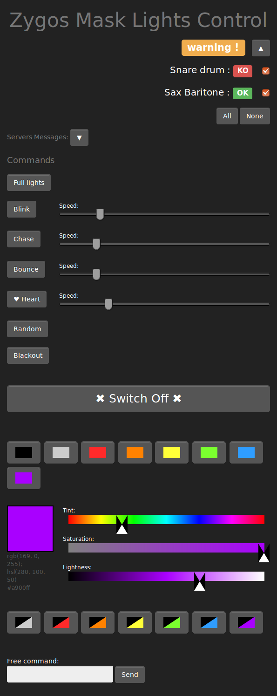
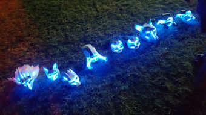

Zygos Mask Lights project

ZML_WEBCONTROL
==============

### Summary

Control WS2812 leds with a NodeMCU (esp8266 card) connected to a WiFi network, by commands sent by a HTML interface thru WebSockets.
This part concerns the web page to send commands to the masks.

Abstract
--------

This repository is part of the Zygos Mask Lights project, inserting leds into masks and control them over a wifi network.

This part contains the code for the web page to send commands to the masks via WebSocket.

The other parts are:
- [zml_wsserver](https://github.com/joliclic/zml_wsserver): code of the microcontroller listening the network via WebSocket, and command the leds inside the mask.
- [zml_nodemcu_box](https://github.com/joliclic/zml_nodemcu_box): plan for a box for the NodeMCU card, made with MDF cutted by laser.

What is ZYGOS MASKS LIGHTS ?
----------------------------

The [Zygos Brass Band](http://zygos.fr)  uses for its show named "Trybz" masks made with polypropylene sheet cutted with laser (original plans by Wintercroft). This project add some leds (WS8266 plugged into a NodeMCU card) inside them, and control them with a tablet/smartphone over a wifi network via WebSocket.

Organisation of this code
-------------------------

The masks and their leds are commanded from a single static web page.
The different part of this page, JavaScript, CSS, and localisation, are built from a Node.js script.

There's 2 JavaScript files in the src folder, `zml.js` is the main program, and `config.default.js` contains some settings. You should create a copy of `config.default.js`, and name it `config.js`, the build system will use it rather than the other. And there you must adapt some values of the `gServers` variable, at least the ip of the masks, according to your network.

The CSS are generated from some [`LessCSS`](http://lesscss.org/) files. The main one is `src/css/zml.less` file.

The page contains localized strings, their sources are in the `src/l10n` folder.
To add a language, create an folder in the `l10n` directory, named like you want (its name will be used in the name of the generated file), and copy inside a version of the `zml.properties`, and translate it.
The `zml.properties` is a [`.properties`](https://en.wikipedia.org/wiki/.properties) file, but it must be **utf-8** encoded.

Dependencies
------------

You need [Node.js](https://nodejs.org) to generate the HTML files. And install the node dependencies for this project (`npm install` from the main folder).

`node build.js` will generate localized version of the html page in the `www` directory.

How to use it ?
--------------- 

You must be connected on then same network with the mask, then simply open the html page in a browser, and try some command.

Tip:
You can copy the HTML page on a android device, for example in a `myfolder` directory, then open it in a browser (Chrome or Firefox) with:  
`file:///sdcard/myfolder`  
then open `zml_en.html`

License
-------

All the code is under the MIT license.

---

screenshot of the control /page:

link to a demonstration video:

photos:

